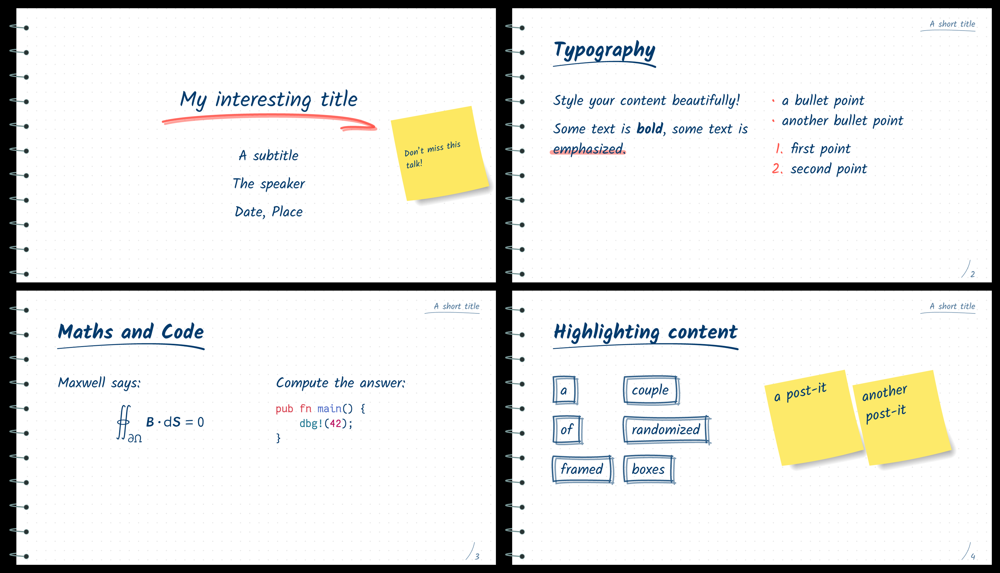

# Jotter

A template for creating presentation slides with Typst and
[Polylux](https://github.com/polylux-typ/polylux/).

Use via
```sh
typst init @preview/jotter-polylux:0.1.0 your-cool-project
```

A `slides.typ` file will be created for you and contains all the design elements
you can use.

By default, it uses the fonts Kalam and .
Either make sure you have them installed or specify other fonts in the template.




